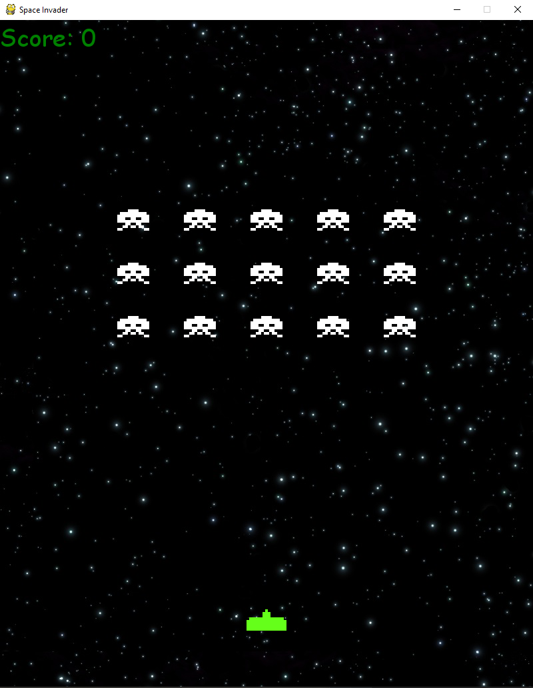

# Pygame Space-Invader

My (simple) implementation of the game Space Invader for a student tutorial. This implementation uses Python and Pygame, a game programming library. The functions are not fully implemented but should be easy to be improved.

## Project Organisation

- main.py: the main game code
- pygame_text.py: use to test if Pygame is working

## Requirements

- Python 3
- Pygame 1.9

## Credits

- Assets in this game are from: <https://github.com/DamirSvrtan/space-invaders.rb>